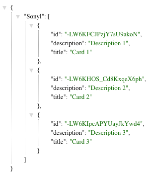

#  React: Idea Board Backend

Author: Sonyl Nagale (sonyl.nagale@ga.co)

Release: 0.0.0

## Usage

This API backend is to simplify the [React Idea Board project](https://git.generalassemb.ly/react-development/idea-board) for the React Part-time course.

The API has 4 specific endpoints with permutations:

  1. `/list`: displays all data in the database.
      * `/list/:name`: displays all data for the { String } `name` parameter
  1. `/create`: enters information into the database of this format:
      * `{ String } title`
      * `{ String } description`
      * `/create/seed`: enters test data for quickstart.
  1. `/update/`: Updates a specific idea. `id` is POSTed.
  1. `/delete/:id`: Deletes a specific user and all its data.

### Listing Data

The `/list` and `/list/:name` URLs will list all data (https://react-idea-board-backend.herokuapp.com/list/) or data for a specific name (https://react-idea-board-backend.herokuapp.com/list/Sonyl)

The data is presented in JSON format in both cases, using Firebase IDs:

_All Data_

_User Data_

## Caveat

The API only has rudimentary sanitization, so please discourage students from trying to break it with XSS or other means.

## Stood-up URLs to Distribute to Students

Sample Listing:  `https://react-idea-board-backend.herokuapp.com/list/``

* Create: `POST https://react-idea-board-backend.herokuapp.com/create/:name`
    * POST Parameters:
        1. `{ String } description`
        1. `{ String } title`
* Read: `GET  https://react-idea-board-backend.herokuapp.com/list/:name`
    * GET Parameter
        1. `{ String } username` within the URL, _e.g._ `https://react-idea-board-backend.herokuapp.com/list/Sonyl`
* Update: `PUT https://react-idea-board-backend.herokuapp.com/update/:name/ideas/:id`
    *  GET Parameters
        1. `{ String } username` within the URL
        1. `{ String } id` Firebase ID of the idea, within the URL
    * PUT Parameters
        1. `{ String } title`
        1. `{ String } description`
* Delete: `POST https://react-idea-board-backend.herokuapp.com/delete`
    *  POST Parameter
        1. `{ String } id` Firebase ID of the idea

## Technologies

* Node.js
* Express
* Firebase
